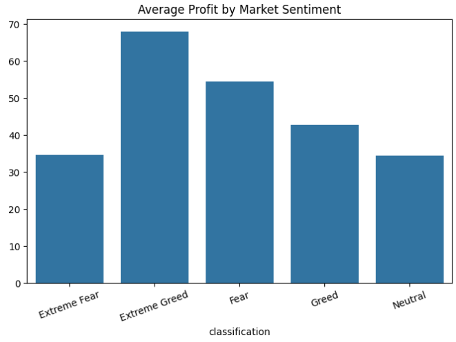
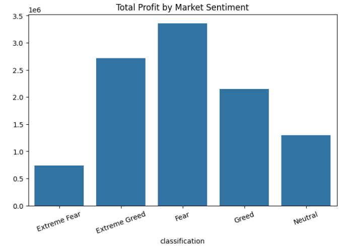
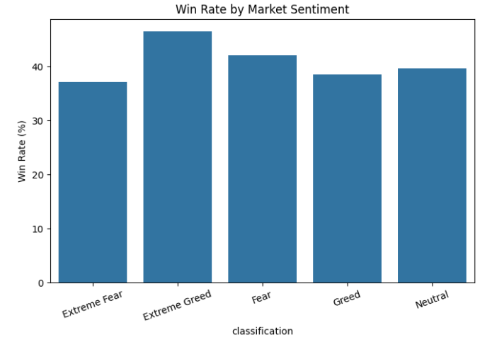
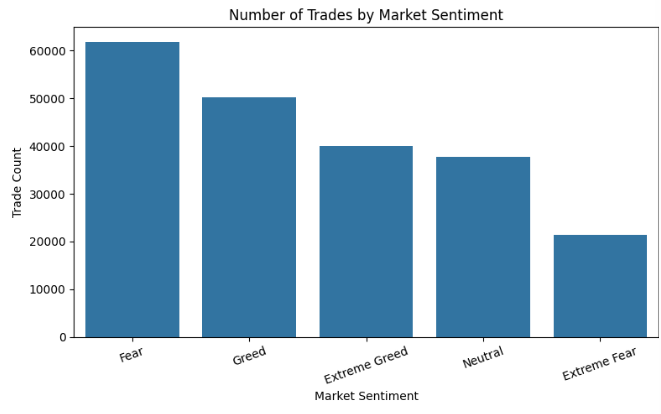
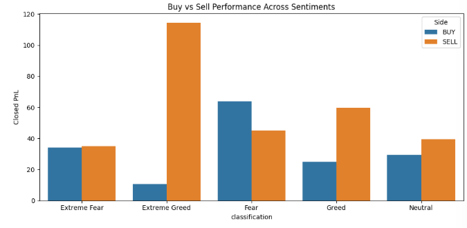

Bitcoin Market Sentiment Analysis

Project Overview

This project analyzes the relationship between Bitcoin market sentiment and trader performance using the Bitcoin Fear & Greed Index and Hyperliquid historical trading data.

The objective is to investigate how different market sentiment conditions (Fear, Extreme Fear, Greed, and Extreme Greed) influence trader profitability, win rates, and overall trading behavior.

Problem Statement

Financial markets are heavily influenced by investor sentiment. This project aims to determine whether market sentiment has a measurable impact on trading outcomes by combining sentiment data with real-world trading records.

Key questions explored:

* Do traders perform better during Greed or Fear periods?
* Which sentiment category generates the highest profits?
* How does win rate vary across market conditions?
* Can sentiment indicators provide insights for trading strategies?

Datasets Used

1. Bitcoin Fear & Greed Index

Contains daily Bitcoin market sentiment classifications.

Columns:

* Date
* Value
* Classification (Extreme Fear, Fear, Neutral, Greed, Extreme Greed)

2. Hyperliquid Historical Trading Data

Contains historical cryptocurrency trading records.

Columns include:

* Account
* Coin
* Execution Price
* Size USD
* Side (Buy/Sell)
* Closed PnL
* Fee
* Timestamp

Technologies Used

* Python
* Pandas
* NumPy
* Matplotlib
* Seaborn
* Google Colab
* GitHub

Data Processing Workflow

1. Loaded and explored both datasets.
2. Cleaned and formatted date columns.
3. Converted timestamps into a common format.
4. Merged trading data with sentiment data using trade dates.
5. Performed exploratory data analysis (EDA).
6. Calculated profitability and win-rate metrics.
7. Generated visualizations to identify patterns and insights.

Analysis Performed

Average Profit by Market Sentiment

->Analyzed average Closed PnL for each sentiment category.

Total Profit by Market Sentiment

->Calculated cumulative profit generated under each market condition.

Win Rate Analysis

->Measured the percentage of profitable trades across sentiment categories.

Trade Volume Analysis

->Examined the distribution of trading activity across sentiment states.

Buy vs Sell Performance Analysis

->Compared profitability of Buy and Sell trades under different market sentiments.

Key Findings

1. Extreme Greed Generated the Highest Average Profit

Traders achieved the highest average profit during Extreme Greed periods, suggesting strong bullish sentiment often coincides with profitable trading opportunities.

2. Fear Generated the Highest Total Profit

Although Extreme Greed produced the highest average profit per trade, Fear periods generated the largest cumulative profit due to increased trading activity.

3. Extreme Fear Produced the Weakest Results

Extreme Fear periods showed the lowest average profitability and lowest win rates, indicating challenging market conditions for traders.

4. Market Sentiment Influences Trading Performance

The analysis demonstrates a clear relationship between market sentiment and trader outcomes, highlighting the value of sentiment indicators in market analysis.

Visualizations

Average Profit by Market Sentiment

Total Profit by Market Sentiment

Win Rate by Market Sentiment

Trade Count by Market Sentiment

Buy vs Sell Performance

Conclusion

This project demonstrates that Bitcoin market sentiment has a significant relationship with trader profitability and performance. Traders generally performed better during Greed and Extreme Greed periods, while Extreme Fear conditions were associated with lower profitability and success rates.

The findings suggest that incorporating sentiment indicators into trading analysis may help traders better understand market conditions and improve decision-making.

Future Improvements

* Apply machine learning models to predict trader profitability.
* Analyze leverage usage across sentiment categories.
* Perform account-level trader performance analysis.
* Build an interactive dashboard using Streamlit or Power BI.
* Incorporate additional market indicators for deeper insights.

 Author

**Rizwanul Jannah**

Final Year Engineering Student

Skills: Python, Data Analysis, Pandas, NumPy, Data Visualization, GitHub
